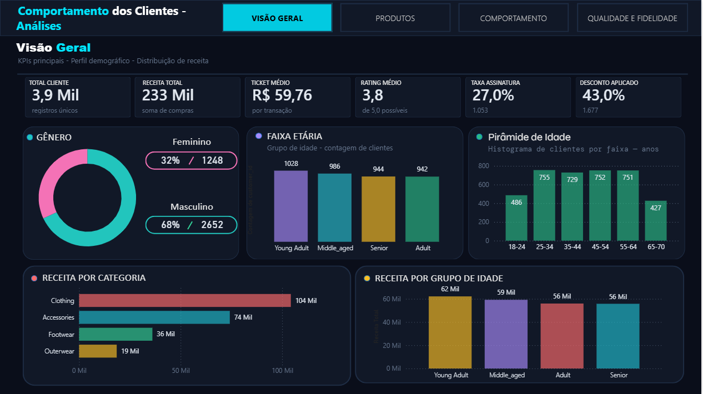
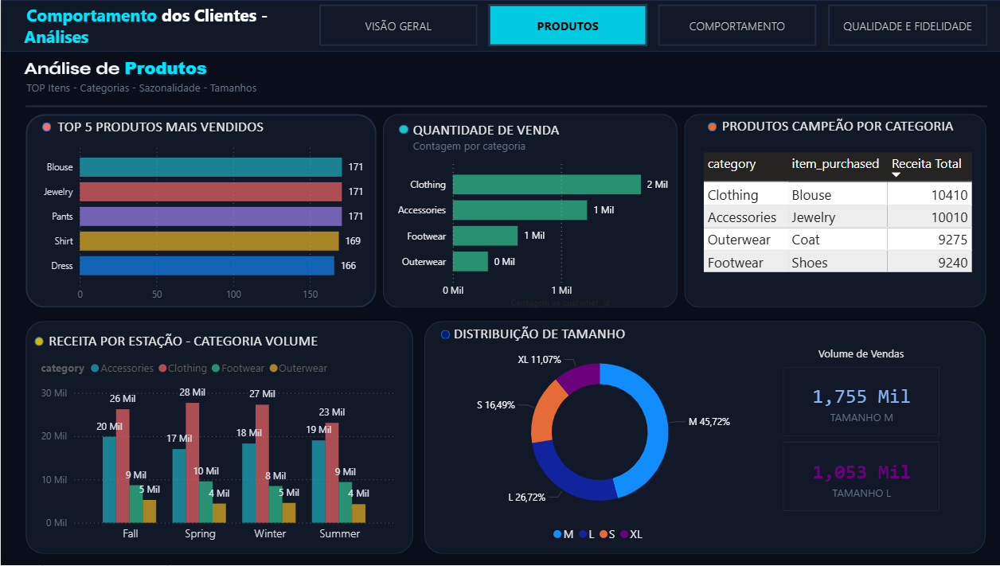
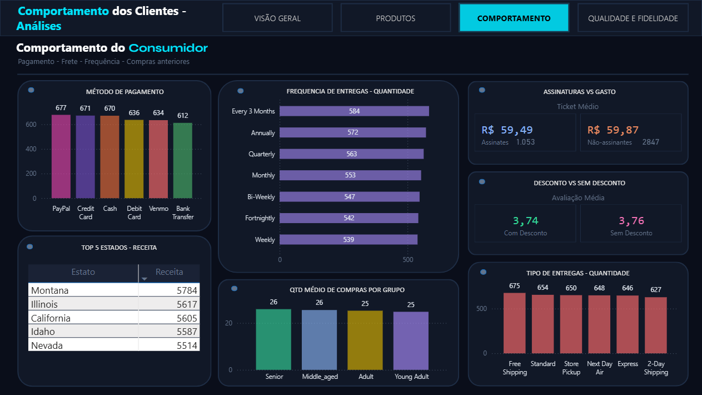
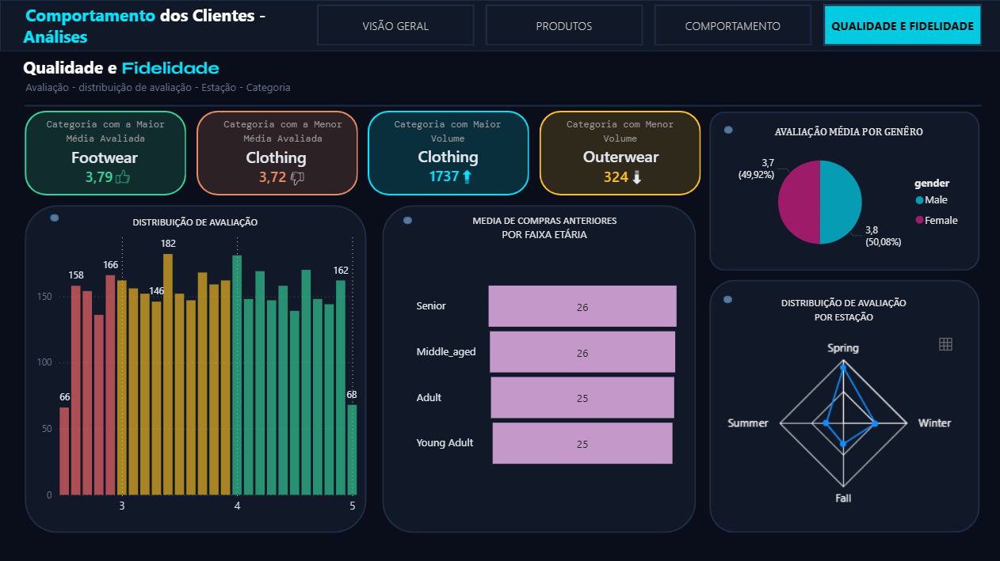

# 📊 Dashboard de Análise de Comportamento do Cliente

## 📝 Descrição

Este projeto consiste em um dashboard interativo desenvolvido no *Power BI* para analisar padrões de consumo e comportamento de clientes. O objetivo principal gerar insights estratégicos que auxiliem na segmentação de público, otimização de campanhas de marketing baseado nos padrões de comportamento dos usuarios.

## 🎯 Objetivos de Negócio

* Identificar o perfil demográfico dos clientes (Idade, Gênero, Localização).
* Analisar a frequência de compra e os métodos de pagamento preferidos.
* Avaliar a performance de categorias de produtos e o impacto de descontos nas vendas.
* Monitorar o índice de satisfação (Rating) por segmento.

## 📄 Páginas

* 
* 
* 
* 

## 🛠️ Tecnologias e Ferramentas

* *Python:* Analise exploratória e pré-processamento dos dados.
* *PostgreSQL* Pra validação dos dados.
* *Power BI:* Construção do dashboard e visualizações.
* *DAX:* Criação de medidas calculadas e KPIs.
* *CSV:* Fonte de dados (`customer_shopping_behavior.csv`).

## 📈 Principais KPIs Analisados

* **Total de Receita:** Valor total gerado no período.
* **Ticket Médio:** Valor médio gasto por transação.
* **Avaliação Média (Rating):** Score de satisfação por categoria de produto.
* **Nível de Fidelidade:** Impacto da assinatura (Subscription Status) no consumo.

## 💡 Insights Obtidos

* *68% dos clientes são do gênero masculino*, enquanto o feminino representa 32% (1.248 clientes).
* *Receita total de R$ 233 mil*, com ticket médio de R$ 59,76 por transação.
* *Clothing é a categoria campeã* em receita e volume, liderada pelo produto Blouse (10.410 unidades).
* *Young Adults* são o grupo de maior receita (R$ 62 mil), seguido por Middle-Aged (R$ 59 mil).
* *Taxa de assinatura de 27%* — clientes assinantes têm ticket médio muito próximo dos não-assinantes, levantando questionamentos sobre o impacto do programa de fidelidade.
* *Footwear tem a maior média de avaliação* (3,79), enquanto Clothing tem a menor (3,72).
* O tamanho *M domina as vendas* com 45,72% do volume total (1.755 unidades).

## 🚀 Como Visualizar

1. Faça o download do arquivo `DARK-DASHBOARD-PORTIFOLIO.pbix`.
2. Abra-o no **Power BI Desktop**.
3. Caso as fontes de dados não carreguem, aponte o caminho do arquivo para o `customer_shopping_behavior.csv` localmente.

---
**Desenvolvido por ClevertonRS**
[![LinkedIn]](https://www.linkedin.com/in/cleverton-rocha-175aa8333)
